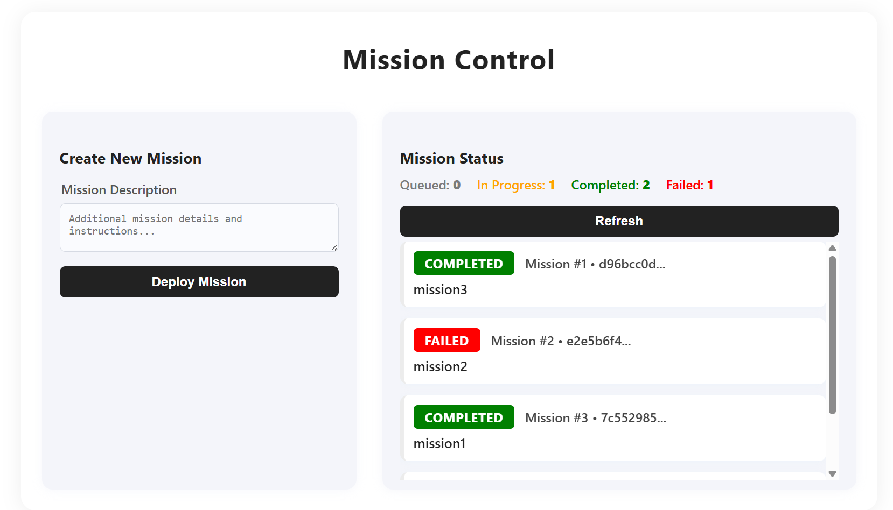

# Mission Control Project

## Scope and Objectives
This project implements a secure, asynchronous command and control system for military operations using Go, RabbitMQ, and Docker. The Commander's Camp issues orders, and Soldier Workers execute them, reporting status back through a central hub.

## Design Rationale
- **GoLang:** Chosen for its concurrency, simplicity, and containerization support.
- **RabbitMQ:** Used for reliable, asynchronous message passing.
- **Token Rotation:** Short-lived tokens ensure secure identity management.

## API Documentation
- `POST /missions`: Submit a mission. Returns `mission_id`.
- `GET /missions/{mission_id}`: Get mission status.

## AI Usage Policy
AI tools were used to generate code templates, Dockerfiles, and orchestration scripts. Prompts included:
- "Go RabbitMQ example for producer/consumer"
- "Go REST API with Gin"
- "Dockerfile for Go service"

## Setup Instructions
1. Clone the repository.
2. Run `docker-compose up --build`.
3. Use `test_missions.sh` to test the system.

## How to Run Tests
Execute `./test_missions.sh` to submit and track missions.

## Architecture diagram

