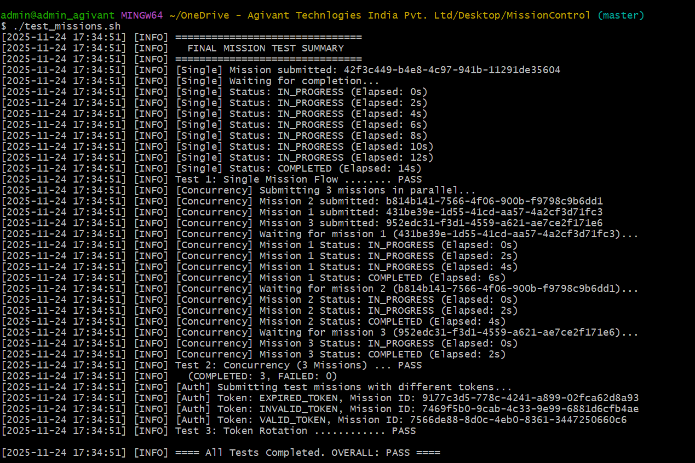

# Mission Control Project

## Scope and Objectives
This project implements a secure, asynchronous command and control system for military operations using Go, RabbitMQ, and Docker. The Commander's Camp issues orders, and Soldier Workers execute them, reporting status back through a central hub.

Fig: frontend

## Design Rationale
- **GoLang:** Chosen for its concurrency, simplicity, and containerization support.
- **RabbitMQ:** Used for reliable, asynchronous message passing.
- **Token Rotation:** Short-lived tokens ensure secure identity management.

## API Documentation
- `POST /missions`: Submit a mission. Returns `mission_id`.
- `GET /missions/{mission_id}`: Get mission status.

## AI Usage Policy
AI tools were used to generate code templates, Dockerfiles, and orchestration scripts. Prompts included:
- "Go RabbitMQ example for producer/consumer"
- "Go REST API with Gin"
- "Dockerfile for Go service"

## Setup Instructions
1. Clone the repository.
2. Run `docker-compose up --build`.
3. Use `test_missions.sh` to test the system.

## How to Run Tests
Execute `./test_missions.sh` to submit and track missions.

Fig:  Example Mission Submission and Status Check Output

## Architecture diagram

The diagram above illustrates the key components and data flow of the Mission Control system:

**Mission Control Dashboard (React, HTTP):**
This is the web frontend through which users (commanders) submit new missions and view mission status. All interactions with the backend occur over HTTP.

**Commander Service (Go/Gin, In-Memory):**
The central API backend, written in Go using the Gin framework. It receives mission requests from the Dashboard, emits mission commands to RabbitMQ for execution, and stores mission status in memory for fast retrieval.

**RabbitMQ (orders_queue, status_queue):**
RabbitMQ serves as the central message broker.

orders_queue is where new missions are published by the Commander Service for execution.

status_queue is where mission status updates from workers are received.

**Soldier Worker Cluster (N Workers):**
Represents a scalable group of worker containers ("Soldiers").

Any number of worker containers can be run simultaneously to process missions in parallel.

Workers subscribe to orders_queue to receive missions and publish status updates to status_queue after task completion.

**Data Flow:**

The user dashboard sends mission requests (HTTP) to the Commander Service.

Missions are queued in RabbitMQ by the Commander Service (orders_queue).

One of the available Soldier Workers picks up each mission from the queue, performs its assigned task, then reports back status to RabbitMQ (status_queue).

The Commander Service consumes these status updates and updates the mission status for the Dashboard.

**Scalability:**
The number of Soldier Workers (N) is not fixed—they can be scaled up or down at runtime using Docker Compose, allowing the system to handle any workload from a single mission to thousands in parallel.

## Flowchart - Mission Control

## Worker Scalability and Horizontal Scaling
This project is designed for scalable, parallel processing using as many Soldier Worker containers as needed. By default, docker-compose.yml does not specify a fixed number of workers.
You can add or remove worker containers dynamically according to your workload or available resources.

If you want to run multiple workers in parallel, use the following command:

docker compose up --scale soldier_worker=N
Where N is the number of worker containers you want to run at once (for example, --scale soldier_worker=5).

There is no upper limit imposed by the configuration—you are free to scale horizontally for any use case.
If you do not specify --scale, Docker Compose will just start one worker container by default.

All workers automatically connect to RabbitMQ, share the task queue, and independently process missions—enhancing reliability and system throughput.