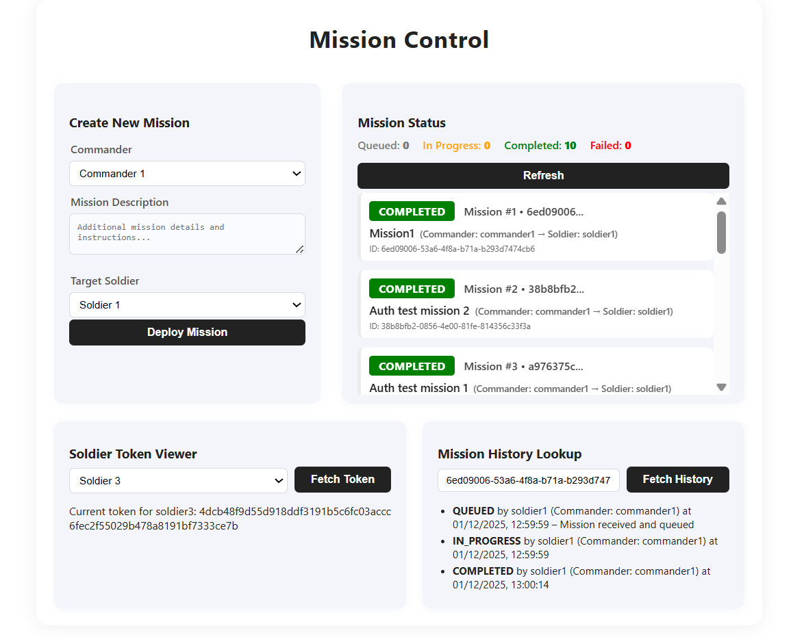
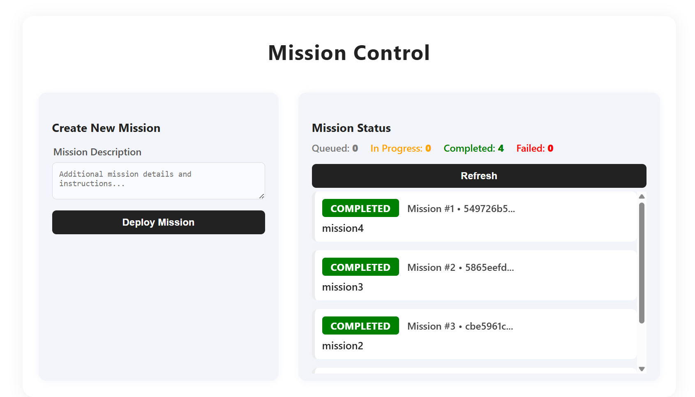

# Mission Control Project

## Scope and Objectives
This project implements a secure, asynchronous command and control system for military‑style operations using Go, RabbitMQ, Docker, and a React dashboard. The Commander Services issue missions, Soldier Workers execute them, and all communication flows through RabbitMQ with short‑lived tokens for identity rotation.

Fig: frontend

## The Mission Control Dashboard (React) lets a user:
- **Submit new missions.**
- **Choose a target soldier for each mission.**
- **View live mission status and history.**

## Design Rationale
- **GoLang:** Chosen for its concurrency, simplicity, and containerization support.
- **RabbitMQ:** Reliable message broker for decoupled, asynchronous mission delivery.
- **Token Rotation:**  Soldiers use short‑lived tokens (≈30s) that are rotated via the commander, and only SHA‑256 token hashes are stored for verification.

## Core Components
- **Mission Control Dashboard (React):**
- Sends HTTP requests to a specific Commander Service.
- Endpoints used: /missions, /missions/:id, /missions/:id/history.

- **Commander Services (Go/Gin):**
- Expose HTTP API for missions and token rotation.
- Publish missions to per‑soldier RabbitMQ queues.
- Consume status updates from RabbitMQ and keep in‑memory  mission state and history.
- Store for each mission: mission_id, payload, status, target_soldier, assigned_soldier, and commander_name.

- **RabbitMQ:**
- orders_<commander>_<soldier>: missions from a specific commander to a specific soldier.
- status_<commander>: status updates (with token) from all soldiers of that commander.

- **Soldier Workers (Go):**
- Each worker is configured with COMMANDER_NAME and SOLDIER_NAME.
- Consumes missions from orders_<commander>_<soldier>.
- Executes work, then publishes status (including its token) to status_<commander>.
- Calls /auth/refresh_token on its commander every 30 seconds to rotate its token.

## Token Rotation and Authentication
- Each soldier periodically calls POST /auth/refresh_token with headers X-SECRET and X-SOLDIER.
- Commander generates a random 256‑bit token, hashes it with SHA‑256, and stores only the hash per soldier.
- When a status update comes in on status_<commander>, commander hashes the provided token and compares it to the stored hash; invalid tokens are rejected and the mission status is not updated.
- Status history is stored as a list of events with fields: status, timestamp, optional message, and soldier name.

## AI Usage Policy
AI tools were used to generate code templates, Dockerfiles, and orchestration scripts. Prompts included:
- "Go RabbitMQ example for producer/consumer"
- "Go REST API with Gin"
- "Dockerfile for Go service"

## Setup Instructions
1. Clone the repository.
2. Run `docker-compose up --build`.
3. Use `test_missions.sh` to test the system.

## How to Run Tests
Execute `./test_missions.sh` to submit and track missions.

Fig:  Example Mission Submission and Status Check Output

## The script:

- Targets a specific commander via COMMANDER and BASE_URL="http://localhost:808${COMMANDER}".
- Test 1 – Single mission: sends one mission, polls /missions/{id} until it reaches COMPLETED or FAILED, and logs status along with assigned_soldier and commander_name.
- Test 2 – Concurrency: submits three missions in parallel, waits for each to finish, and reports how many completed or failed.
- Test 3 – Token rotation: submits missions while soldiers are rotating tokens every 30 seconds, ensuring missions are still accepted and processed.
- Prints a final overall PASS or FAIL summary.

## Architecture diagram

The diagram above illustrates the key components and data flow of the Mission Control system:

- React Dashboard → Commander Service over HTTP.

- Commander Service → RabbitMQ orders_<commander>_<soldier> for missions.

- Soldier Workers ← consume from their own orders queues.

- Soldier Workers → RabbitMQ status_<commander> for status + token.

- Commander Service ← consumes status_<commander>, verifies token hash, and updates in‑memory missions and history.

## Flowchart - Mission Control

## Worker Scalability and Horizontal Scaling
This project is designed for scalable, parallel processing using as many Soldier Worker containers as needed. By default, docker-compose.yml does not specify a fixed number of workers.
You can add or remove worker containers dynamically according to your workload or available resources.

If you want to run multiple workers in parallel, use the following command:

docker compose up --scale soldier_worker=N
Where N is the number of worker containers you want to run at once (for example, --scale soldier_worker=5).

There is no upper limit imposed by the configuration—you are free to scale horizontally for any use case.
If you do not specify --scale, Docker Compose will just start one worker container by default.

All workers automatically connect to RabbitMQ, share the task queue, and independently process missions—enhancing reliability and system throughput.